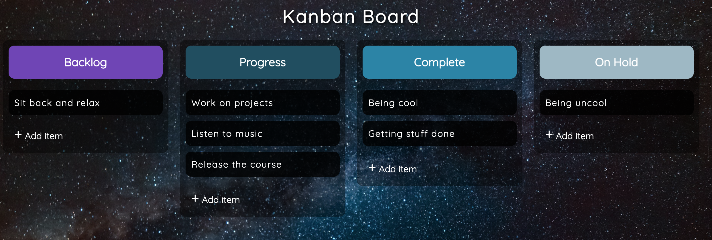
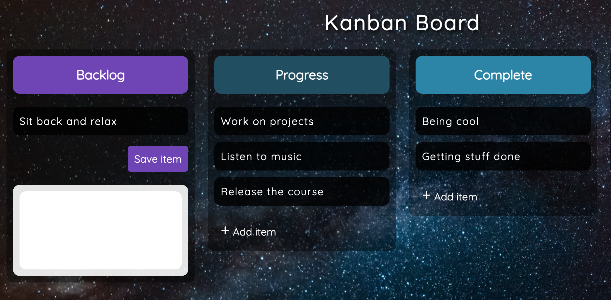

## Drag and Drop items Panel

Developed with only the basic web trivia: Vanilla JS, HTML & CSS.

### Instructions

Just download and launch the HTML file on your favorite browser!

### Features

- Initialize with a ddefault item list if none is availble
- Add Item
- Remove Item (using focus out of an item)
- Custom scroll bar for big items [See reference here](https://css-tricks.com/the-current-state-of-styling-scrollbars-in-css/)
- Drag itens thru the columns
- Responsive

### Images

